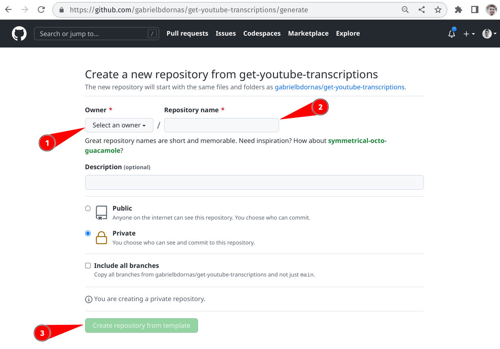
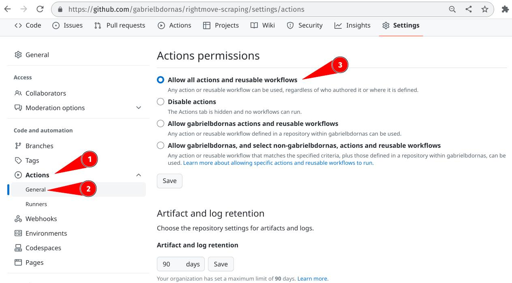
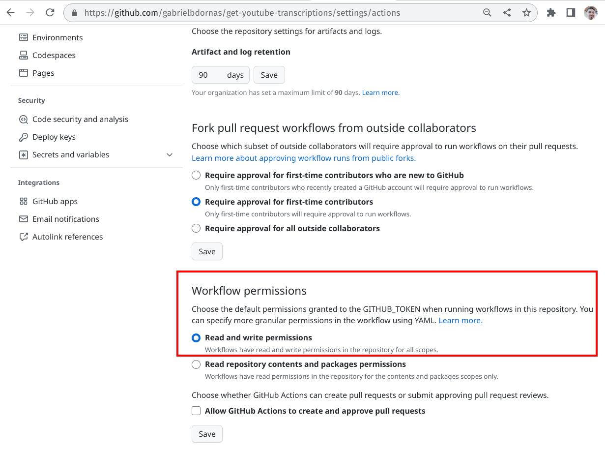

# Get YouTube Transcriptions :film_strip:

This repository aims to show a web-scraping process running inside GitHub actions.
The repository infrastructure was thought to simplify project setup and usage.
The main idea here is to let you get your web data in a few clicks, in an easy "plug in and play" process.
Local repo clone or python environment configuration isn't necessary, although they could be done, being possible to use GitHub Actions to save the data in `csv` files.

## Setup :open_book:

- Access the public [rightmove-scraping
](https://github.com/gabrielbdornas/rightmove-scraping).

- Create a new repository from the repo template option (green button at the middle right of the page):

- Allow all GitHub actions to be used:

- Allow GitHub actions to read and write in your brand new repository (at the very end of the page shown above):

## Usage

- `scraping` Make target was created to automate the local running process.
- To run the scraping periodicaly on GitHub Actions update the `.github/workflows/main.yml` file with a properly [cron](https://crontab.guru/) option:

https://github.com/gabrielbdornas/rightmove-scraping/blob/fac64867e224a1f22593b865cadf31f0881fdbf6/.github/workflows/main.yml#L3-L5

Obs.: The process take more than 8 hours to finish.

## Contributions

Found something wrong or would like to send a suggestion.
Open an [Issue](https://github.com/gabrielbdornas/rightmove-scraping/issues) for us.

[^1]: You could check the running process at the repos' `Actions` tab or at the end of the last repo commit.